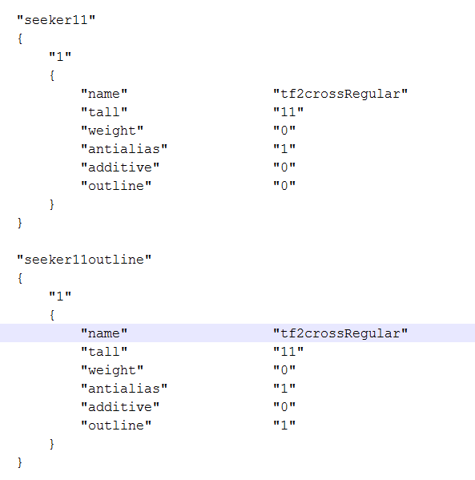
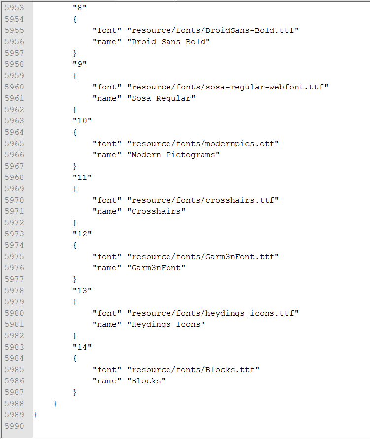
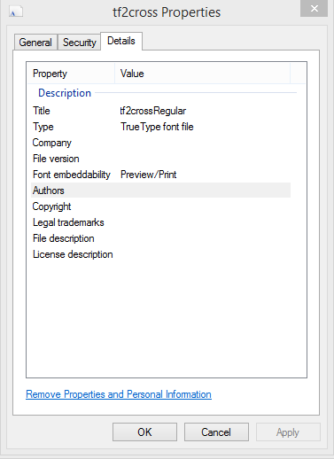
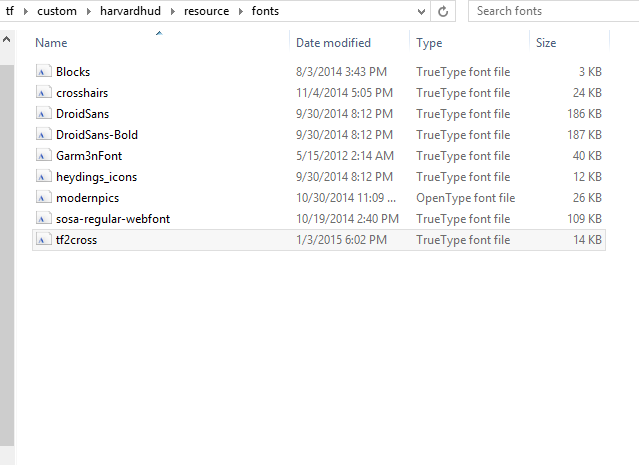
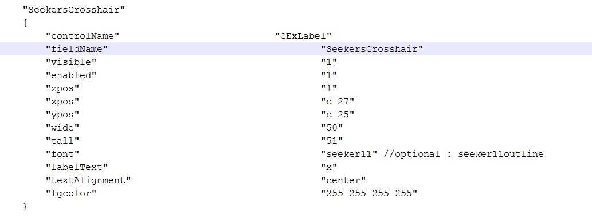

# Installing Font Crosshairs

_Originally posted by [HarvardBB](https://github.com/harvardbb) on the huds.tf guide forums_

HUD Crosshairs are easy to install, but hard to make. For the simpleness of this thread, we will install pre-made crosshairs instead of making our own. Also a note, this installation is only for Windows, sorry Mac, and Linux users.

For the sake of this tutorial we will be installing Seeker's Crosshair ([Download](https://raw.githubusercontent.com/Hypnootize/TF2-HUD-Crosshairs/master/crosshairs/TF2Crosshairs.ttf), [Linux Download](https://raw.githubusercontent.com/Hypnootize/TF2-HUD-Crosshairs/master/crosshairs/tf2crosshairs_linux.ttf)) onto my HUD, [HARVARDHUD](https://github.com/harvardbb/harvardhud).

**You Will Need**

* A HUD
* Notepad++(Download)
* The crosshair font file of your choice

**Step 1.**

Locate your HUD files, you can do this easily by going to your Steam Library, right-clicking on Team Fortress 2, select Properties, select the "Local Files" tab, select "Browse..", select the `tf` folder, select the `custom` folder, and inside should be your HUD folder.

**Step 2.**

First we need to install the font file into the HUD. First, locate the `clientscheme.res` file by going to `harvardhud/resource` and you will find it in there. Next, press CTRL+F and search for `ECON FONTS` and scroll down till you find a section called `HUD Fonts`, this name will differ from HUD to HUD, but my HUD has all of the HUD Fonts under `HUD Fonts`. You must then add this section of code into the client scheme here. This will give you the flexibility to have the crosshair with or without an underline, which ever you prefer.

```json
"seeker11"
{
        "1"
        {
                "name"                  "TF2Crosshairs"
                "tall"                  "11"
                "weight"                "0"
                "antialias"             "1"
                "outline"               "1"
        }
}
```

Should look like this:



**Step 3.**

Now, while still inside the client scheme, scroll down to the very bottom.  You will find something that looks similar to this



You must add this exact code under the last font definition, and your font definition numbers should go in order, so for me, Seeker's Crosshair font will be `15`. The font name is also not a choice, it is what the author of the font signed it as, you can find out the exact name of any font by right-clicking the font, selecting Properties, selecting Details, and the `Title` of the font is the name.

```json
"15"
{
  "font" "resource/crosshairs/TF2Crosshairs.ttf"
  "font" "resource/crosshairs/tf2crosshairs_linux.ttf" [$LINUX]
  "name" "TF2Crosshairs"
}
```

See here:



The result should look something similar to this:


**Remember to save your file!**

**Step 4.**

Locate the `hudlayout.res` file by going to `harvardhud/scripts` and it will be in there. Most HUDs will have there crosshairs right in the front, as mine does as well. My HUD is a little bit more trickier than other HUDs as I have pre-animated, and pre-outlined HUD crosshairs to choose from. You can install the HUD Crosshair anywhere in the file, for the sake of the order of my crosshairs in my HUD, I'm going to be doing it a certain way, you can put it at the very top if you would like.

The file when you first open it should look something like this:


Now press CTRL+F and search for "YZ50KonrWings" as I will be installing the Seeker's Crosshair right underneath that, this is only for my HUD, and your HUD will most likely be different. Now insert this section of code into the file.

It should look something like this:


If you want to change the color of the crosshair, you have to edit the `fgcolor`, you can pick out the color by using this to help you select a color, note the first digit is the red value, second digit is green, third is blue, and the final digit is the alpha or transparency value, you should leave that at `255` unless you actually do want a transparent crosshair (which most do not). Now if the crosshair is not perfectly centered, you must mess with the `xpos`, `ypos`, and `wide`, and `tall` values. It can sometimes be a very painful process, though I am almost certain that the way the Seeker's Crosshair is now, it is perfectly centered, so do not mess with it unless you are positive it is not centered.

**Remember to save the file!**

**Final Step.**

Now take the font file previously mentioned above and install it in the HUD. Most HUDs tend to have a dedicated `fonts` folder for their HUD, most HUDs including my own will have it be in `harvardhud/resource/fonts` and you just drop the file into there. Note, the file path of the installed font in the client scheme must match.

See here:


See how the file path is the same.
The end result of the font folder should look something like this:



**Now enabling the font is by far the easiest part.**

All you do is go into the `hudlayout.res` file in `harvardhud/scripts`, and find the HUD crosshair you want to use, and make the `enabled` and `visible` value both `1`, although most HUDs including my own have all crosshairs enabled, but not visible, so you will most likely only have to change the value of `visible`.

Enabling Seeker's Crosshair will look like this:



**And of course, do not forget to save the file!**

Sorry for the long wall of text and the messy guide, but hopefully it will get the job done.
